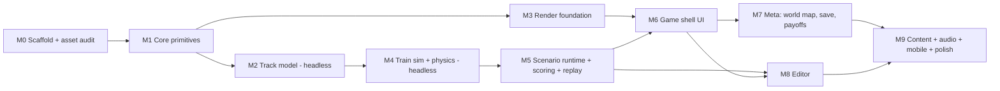

# 70 — Implementation Plan

Doc version: 1.0.0 · The orchestrator's execution artifact. Written to CLAUDE.md's contract.

## 0. How to use this plan

Each task block below **is** the worker's Task Contract (CLAUDE.md): allowed/forbidden
files, reused interfaces (sections of 30/40/60), acceptance criteria, and verification. The
orchestrator delegates one task at a time per lane, reviews the diff against the acceptance
list, and runs the verification commands before merging. Global rules:

- **Dependencies are frozen** to the list in 30 §1. Any new package → HALT, ask the human
  (CLAUDE.md stop rule). Same for changing any interface in 30 §4 non-additively, skipping
  or deleting tests, or touching anything resembling auth/credentials (there should be none).
- Every task ends with `npm run typecheck && npm run lint && npm run test` green, plus its
  own acceptance checks. `npm run build` green at every milestone close.
- A task that discovers its contract is wrong (spec ambiguity, missing interface) stops and
  reports — it does not improvise interface changes.
- Worker output must include the Task Contract preamble (allowed/forbidden files touched,
  interfaces reused, known risks) per CLAUDE.md.

## 1. Milestone DAG

M2∥M3 and M7∥M8 are parallel lanes. Headless milestones (M1/M2/M4/M5) are fully testable in
CI without a browser — land them first and the rest becomes verifiable presentation.

## 2. Tasks

Notation: **A** allowed files (create/edit) · **F** forbidden (everything not listed is
"don't touch"; F highlights tempting-but-off-limits paths) · **Reuse** interfaces to
implement against · **AC** acceptance criteria · **V** verification beyond the global
commands. ~Half-day scope each.

### M0 — Scaffold (2 tasks)

**M0.1 Project scaffold.** *(largely DONE — see repo)*
A: `package.json`, `tsconfig.json`, `vite.config.ts`, `index.html`, `.gitignore` (exist);
remaining: `.eslintrc`/`eslint.config`, `.prettierrc`, `.github/workflows/ci.yml`,
`src/app/main.ts` (wire the loop cube).
Reuse: 30 §1 stack + canonical commands; `three` pinned at `^0.169` (record in 30 §1).
AC: all npm scripts run; CI workflow runs typecheck+lint+test+build on push; ESLint
`no-restricted-imports` headless-zone rule (30 §2.1) present with a fixture violation test.
V: `npm run dev` serves the app; CI green on the branch.

**M0.2 Procedural meshgen foundation.** *(DONE — this is the Phase-2 build)*
A (exist): `src/core/{math,curves}.ts`, `src/render/meshgen/{palette,sweep,track,rollingstock,structures}.ts`,
`src/lab/main.ts`, `src/core/curves.test.ts`.
Reuse: 60 (procedural spec), 30 §6 curves.
AC: `buildPiece` generates all 16 `PieceType`s; `makeLocomotive`/`makeCarriage`/`makeStation`
+ props build without throwing; one shared vertex-color material; curve endpoint tests green;
the asset lab renders the full set. This module is the basis M3 builds instancing on.
V: `npm run test` green; `npm run build` green; asset lab screenshots render all pieces.

### M1 — Core primitives (2 tasks)

**M1.1 Math, PRNG, hashing, event bus.**
A: `src/core/{types,math,rng,hash,events}.ts` + tests.
Reuse: 30 §4 core types, 30 §3.3–3.4.
AC: `mulberry32` reproduces a published 10-value vector for seed 42; `stateHash` canonical
(key order independent — test shuffled-object equality); typed event bus with unsubscribe.

**M1.2 Fixed-timestep driver.**
A: `src/core/loop.ts` + tests, `src/app/main.ts` (wire cube to loop).
Reuse: 30 §3.1–3.2.
AC: accumulator loop produces exactly 60 ticks/sim-second under mocked frame times (16.6ms,
33ms, 200ms spiral-of-death clamp); interpolation alpha exposed; loop is
pausable/single-steppable (assist mode + tests need this).

### M2 — Track model, headless (3 tasks) — **DONE**

**M2.1 Piece definitions.** *(DONE)*
A (exist): `src/track/pieces.ts` (canonical `PieceType`/`PieceDef`, `PIECE_DEFS` port table,
rotation helpers) + `pieces.test.ts`. (The port table is code, not `data/pieces.json` — the
mesh generator imports `PieceType` from here.)
Reuse: 30 §4 `PieceDef`, 30 §5 port table.
AC met: all 16 `PieceType`s defined; T-1 rotation round-trip; T-2 port table fixture equality.

**M2.2 Placement + validation.** *(DONE)*
A (exist): `src/track/placement.ts` (Grid/terrain, `validatePlacement`, `worldFootprint`/
`worldPorts`) + `placement.test.ts`.
Reuse: 30 §5 validity rules, `PlacementResult`.
AC met: five failure reasons each have a minimal repro; ramp bridges a ±1 step;
bridge-over-water and tunnel-through-rock pass; occupancy respects rotated multi-cell footprints.

**M2.3 Track graph.** *(DONE)*
A (exist): `src/track/graph.ts` (`TrackGraph`: shared-boundary nodes, directed edges,
add/remove, `edgesFrom` switch gating, Dijkstra `shortestPathLength`) + `graph.test.ts`.
Reuse: 30 §4 `TrackGraph`, 30 §5 junction/crossing semantics.
AC met: T-3 add/remove restores graph; `edgesFrom` honors switch states; `shortestPathLength`
matches hand-computed line + junction fixtures; `curveClass`/`grade` per edge.

### M3 — Render foundation (3 tasks) [parallel with M2]

**M3.1 Procedural instancing + scene.** *(DONE — `src/render/instances.ts` + `materials.ts`)*
A (exist): `src/render/instances.ts` (`TrackInstances`), `src/render/materials.ts` (shared
body + glow materials), `src/lab/layout.ts` (demo), `src/render/instances.test.ts`.
Reuse: `render/meshgen/*` (M0.2), 30 §9 budgets.
AC: builds each piece geometry once via `buildPiece`; one shared body material + one glow
material across all types; an `InstancedMesh` per `PieceType` (+ per glow type); `place()`
writes transform + biome tint via `instanceColor`. Verified: 500 straights = 1 draw call; a
one-of-each 16-type board = 17 draw calls (tests). Lab `?view=layout` renders it.
Remaining for a later pass: fold into the real game `scene.ts` + camera rig (M3.2).

**M3.2 Camera rig + grid picking.** *(DONE)*
A (exist): `src/camera/rig.ts` (`createCameraRig` — OrbitControls with clamps + builder mouse/
touch mapping), `src/render/picking.ts` (`pickGround`/`pickCell` → `CellCoord`, hover
highlight), `src/app/input.ts` (`attachBuildInput`: hover/place/remove/rotate/select),
`src/render/picking.test.ts`, lab `?view=build` interactive demo.
Reuse: 30 §12 input table, 30 §9.
AC: orbit/pan/zoom with clamps; raycast → `CellCoord` (tested headlessly incl. sky-miss →
null); hover highlight; left-click place / right-click remove / R rotate / 1–9 select;
touch pan/pinch mapped.

**M3.3 Meshgen polish + biome props.** *(DONE except junction-lever animation node)*
A (exist): `src/render/meshgen/props.ts` (round-tree, snow-fir, cactus, rock, glowing/plain
mushroom), `src/render/meshgen/biomes.ts` (`BIOMES` dressing table: ground/accent + prop
factories per biome), `src/render/meshgen/generators.test.ts`, lab `?view=props` showcase.
Reuse: 60 §4–5, existing generators.
AC: per-biome prop variants added (60 §5, 20 §1 dressing); regression test that every
generator (16 pieces + rolling stock + structures + props + biome factories) builds a
well-formed `{position,normal,color}` non-indexed asset and never throws. **Deferred to M6.2**
(junction interaction): expose the junction lever as a named node for the flip animation — it
is currently baked into the piece glow, which is right for instancing but not yet animatable.

### M4 — Train sim + physics, headless (4 tasks)

**M4.1 Spline compilation + LUTs.**
A: `src/track/splines.ts` + tests.
Reuse: 30 §6, `PathDef`.
AC: LUT lengths within 0.5% of `PathDef.length`; S-1 continuity invariant across all
adjacent piece pairs generated from the port table.

**M4.2 Train kinematics.**
A: `src/train/{types,movement}.ts` + tests.
Reuse: 30 §4 `TrainState`, 30 §6 handoff rules, `data/physics.json` (create from 30 §7 baselines).
AC: P-1 convergence; edge handoff conserves leftover distance (property test: total distance
= Σv·dt over 1000 random tick sequences); carriage trailing walks edge chains correctly
around curves and junctions.

**M4.3 Arcade physics: jumps, derails, collisions.**
A: `src/train/physics.ts` + tests.
Reuse: 30 §7.2–7.4.
AC: P-2 derail threshold fixture; P-3 exact-tick collision; jump launch/landing/bad-landing
each fixture-tested, incl. w2-s5's "Steady teeters into the gorge" case (dead-end below
vJump at height ≥ 1 → `gap`).

**M4.4 Stations, boarding, hazards.**
A: `src/train/stations.ts`, `src/simulation/hazards.ts` + tests.
Reuse: 30 §7.5, 40 §1.1.
AC: dwell/stop/board/deliver event sequence matches a golden trace; capacity respected;
all three hazard kinds fixture-tested (rockfall window, crossing cycle, brokenPiece +
`PieceRepaired`).

### M5 — Scenario runtime (4 tasks)

**M5.1 Schema + validator.**
A: `src/scenarios/{scenario.schema.json,validate.ts,types.ts}` + tests, fixtures
`src/scenarios/fixtures/{example-a,example-b}.json` (from 40 §2–3, B completed to full solution).
Reuse: 40 §4–5.
AC: V1–V5, V7 each have pass+fail tests; both examples validate; unknown-field preservation
test; friendly error objects (`path`, `rule`, `message`).

**M5.2 Sim orchestration + replay.**
A: `src/simulation/{sim,inputs,replay}.ts` + tests.
Reuse: 30 §4 `createSim/applyInput/tick/runHeadless`, 40 §6.
AC: D-1 determinism hash test; replay round-trip (record random inputs → replay → identical
final hash); `referenceSolution` → replay conversion; 10s wall-clock cap on `runHeadless`.

**M5.3 Scoring + personas.**
A: `src/simulation/scoring.ts`, `data/personas.json`, `src/simulation/personas.ts` + tests.
Reuse: 30 §8 formulas, 20 §3 predicates.
AC: SC-1 — the six worked examples E1–E6 (20 §3.1) reproduced exactly; each quirk has a
satisfying + violating synthetic trace; bet-sweep test (10 §13) — stars invariant across bets.

**M5.4 Content CI gate.**
A: `src/scenarios/content.test.ts`, `scripts/verify-scenarios.mjs`.
Reuse: 40 §V6, 20 §6 invariants.
AC: every JSON in `src/scenarios/` is validated + reference-run to 3★ headlessly in CI;
fairness margins asserted; both fixtures pass. **This gate stays green for every later
content task.**

### M6 — Game shell (4 tasks)

**M6.1 Screen state machine + Preview/Countdown UI.**
A: `src/app/screens.ts`, `src/ui/{hud,tray,countdown}.ts`, styles.
Reuse: 10 §3 state table (normative transitions), 30 §10, 30 §12.
AC: state machine is data + tested (every 10 §3 transition, nothing else reachable);
tray placement drives the shared `PlacementSystem`; radial countdown; dispatch-early;
ghost preview + rotate on desktop and touch.

**M6.2 SpeedBet, Watch, junction taps.**
A: `src/ui/{speedbet,watch}.ts`, `src/app/screens.ts`.
Reuse: 10 §8, 30 §5 switch input, 40 §6 input events.
AC: bet screen (skipped when `speedBetAllowed:false`); Watch records all inputs as replay
events; junction tap flips lever animation + sim switch.

**M6.3 Resolve + Results.**
A: `src/ui/results.ts`, `src/effects/crashes.ts`.
Reuse: 30 §7.6 gag table, 10 §7, 20 §8 button copy.
AC: crash → gag by cause (render-only randomness) → "Once more, with feeling"; success →
results tally animation with itemized quirk bonuses; retry restarts instantly with same
scenario, zero meta loss.

**M6.4 Playable vertical slice.**
A: glue only (`src/app/*`), `src/scenarios/w1-s1.json` (authored per 20 §4 brief).
Reuse: everything above.
AC: w1-s1 playable start-to-finish in browser: preview → build under countdown → dispatch →
deliver → placeholder payoff → results with correct stars/Connections vs. E1/E2 fixtures.
V: **human checkpoint** — orchestrator plays it and A/B-verifies feel notes against 10 §1
before M7/M8 proceed.

### M7 — Meta layer (3 tasks) [parallel with M8]

**M7.1 Save system.** A: `src/app/save.ts` + tests. Reuse: 30 §11, 40 §7.
AC: versioned save, migration chain scaffold, corrupt-save quarantine test, debounced writes;
community isolation keys (50 §6).

**M7.2 World map.** A: `src/ui/worldmap.ts`, `data/worldmap.json`, `src/render/mapdiorama.ts`.
Reuse: 10 §5, 20 §5 data + gates.
AC: nodes/edges from data; stage completion draws the glowing line (animated); star gates
12/28 enforced; restoration purchases decrement Connections one-way and persist; completion
meter; Community shelf entry point (stub).

**M7.3 Payoff events.** A: `src/render/payoff.ts`, `src/effects/{particles,celebrate}.ts`, `src/camera/dolly.ts`.
Reuse: 10 §6 table, 30 §9, 60 §3.7.
AC: all five `payoff.type`s implemented, data-driven, skippable, ≤ 10 s; persona vignette
hooks; runs strictly after sim resolution (no sim reads during).

### M8 — Editor (3 tasks) [parallel with M7]

**M8.1 Editor shell + Terrain/Stations modes.** A: `src/editor/{shell,terrain,stations}.ts`, draft storage.
Reuse: 50 §2.1–2.2, shared placement/renderer (50 §1 import rule).
AC: mode bar, brushes, station/passenger/train/hazard panels bound to draft scenario object;
undo/redo ≥ 50; autosave; grid resize with out-of-bounds flagging.

**M8.2 Tray/Stars/Playtest modes.** A: `src/editor/{tray,stars,playtest}.ts`.
Reuse: 50 §2.3–2.5, M6 loop embedded.
AC: playtest = real loop on draft; replays recorded; winning run retained; re-verify button;
star fields locked until a win, then floored per 50 §5.

**M8.3 Publish + import + Community shelf.** A: `src/editor/publish.ts`, `src/ui/community.ts`.
Reuse: 50 §4–6, 40 §8.
AC: V1–V7 cards with "show me"; export file + clipboard; import pipeline with V6 cap;
50 §8 round-trip and publish-gate-math tests; isolation test (campaign save untouched).

### M9 — Content & polish (5 tasks)

**M9.1 World 1 scenarios** (8 JSONs per 20 §4 briefs + hints). A: `src/scenarios/w1-*.json`.
AC: M5.4 gate green; w1-s6 has two V6-viable routes (author both, ship one as reference,
assert the other manually in review).
**M9.2 World 2 scenarios** (8, incl. w2-s5 jump-mandatory). AC: gate green; w2-s5 Steady-run
fixture crashes with `gap`.
**M9.3 World 3 scenarios** (8, two-train; w3-s7 = completed example B). AC: gate green;
every `payoff.type` now used ≥ 1× (10 §13 check becomes part of M5.4 gate).
**M9.4 Audio pass.** A: `src/audio/*` (WebAudio synthesis). Reuse: 60 §7 event→sound table,
10 §11. AC: every event synthesized at runtime (oscillator/noise + envelopes) — no audio
files in the default build; mute/vol settings; if a music bed needs a clip, that is an
explicit human-approved exception (60 §7).
**M9.5 Mobile & perf pass.** A: `src/ui/*.css`, `src/app/input.ts`, `src/render/quality.ts`.
Reuse: 30 §12. AC: touch table fully implemented; 44 px targets audit; HUD reflow ≤ 700 px;
quality tiers auto-select; 30 fps floor on reference mobile (manual measurement recorded in PR).

## 3. Cross-cutting acceptance gates

| Gate | From | Check |
|---|---|---|
| G1 | M0 | typecheck+lint+test+build green in CI on every merge |
| G2 | M1 | D-1/D-2 determinism suite green |
| G3 | M2 | headless-zone import rule violation = CI failure |
| G4 | M5 | content gate (validate + reference-run all `src/scenarios/`) green |
| G5 | M6 | vertical-slice human checkpoint sign-off recorded |
| G6 | M9 | 20 §6 full fairness suite + 60 §9 budgets green |

## 4. Risk register

| Risk | Exposure | Mitigation |
|---|---|---|
| Procedural look doesn't hold across all pieces/biomes | visual quality | generators built & screenshot-reviewed (M0.2 done); `PALETTE`/`CELL` centralized so retuning is one file; iterate via the asset lab |
| Cross-browser float divergence breaks determinism claims | replay/V6 trust | CI is the single verification platform; V6 verifies at import time on the *player's* machine (10 s cap), not against remote hashes; hashes quantize via `toFixed(9)` |
| Junction switch tap UX unclear at speed | M6.2 | lever kitbash has oversized tap target; assist mode pause; playtest checkpoint G5 |
| Kid/elder quirk edge cases (multi-train boarding order) | M5.3 | boarding rule pinned in 20 §3; property tests over random boarding orders |
| Mobile perf on 32×32 grids | M9.5 | budgets in 30 §9 + quality tiers; grid max already capped at 32 |
| Scope creep in editor | M8 | 50 §7 exclusions are contractual; new editor features = human decision |

## 5. Definition of done (v1)

1. Worlds 1–3 (24 stages + 3 side stages) playable desktop-web, touch-functional; all pass G4/G6.
2. 3-star system + Connections + world-map restoration fully working and saved (user req: stages/stars/progression/payoffs — every stage has its payoff event).
3. Editor: create → playtest → publish → share file → import → play, with the publish gate (user req: community foundation).
4. All six persona types delivering the theme (user req: reconnect communities, people types, Connections currency).
5. CI green across G1–G6; zero dependencies beyond 30 §1; no interface in 30 §4 changed non-additively without recorded human approval.
